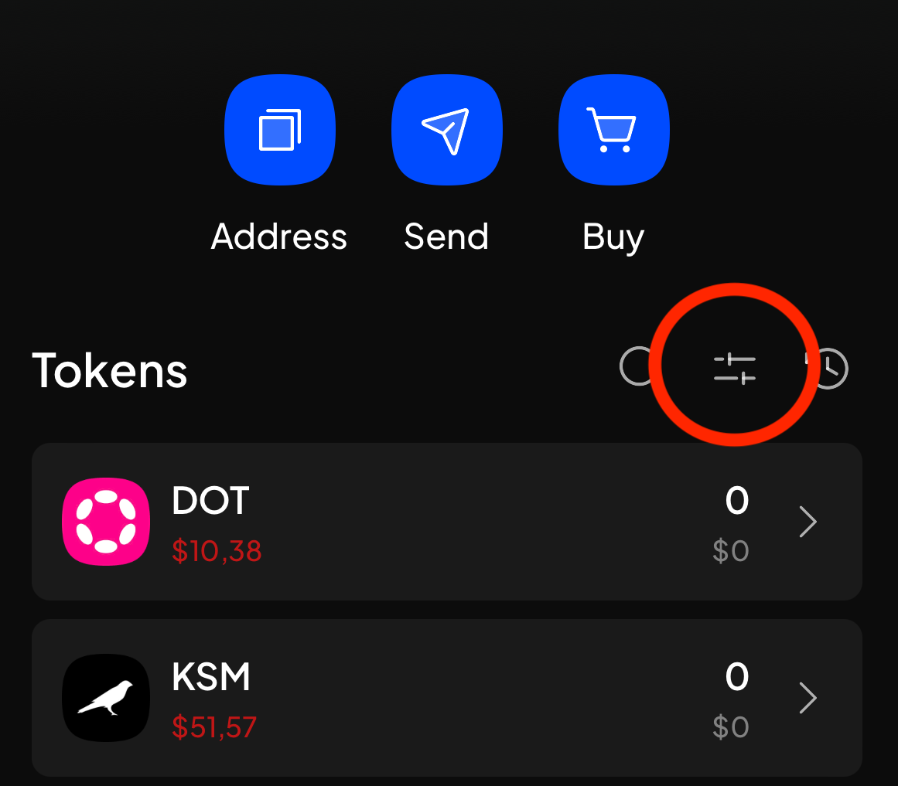

# SubWallet

SubWallet is a wallet for iOS and Android and has a Chrome Extension and Web Dashboard. It supports DENTNet and can be used for [staking.md](../../overview/core-concepts/proof-of-stake/staking.md "mention").&#x20;

You can start by downloading the Subwallet app for your needs at: [https://www.subwallet.app](https://www.subwallet.app).

### Create a Key

First, follow the instructions in the SubWallet app to create a new key. You can also use your existing key if you are already using Subwallet.

### Import DENTNet

In the SubWallet app, tap the menu icon, select "Manage networks" and enable DENTNet.  Follow this video in our tweet to enable DENTNet in the SubWallet app.



### Enable DENTX and DENT token in UI

After you added the DENTNet network in SubWallet you can enable the DENT token and DENTX to show up in the main UI.&#x20;

Tap on the filter icon and enable "Show zero balance".

<figure><figcaption></figcaption></figure>

### Find your DENTNet account address

DENTNet uses account addresses that start with "dx". You can find the address of your SubWallet account by tapping on "DENTX" in the list of tokens. Then tap on the copy icon.&#x20;

The QR code appears and the address is shown at the bottom of the page.

&#x20; &#x20;
