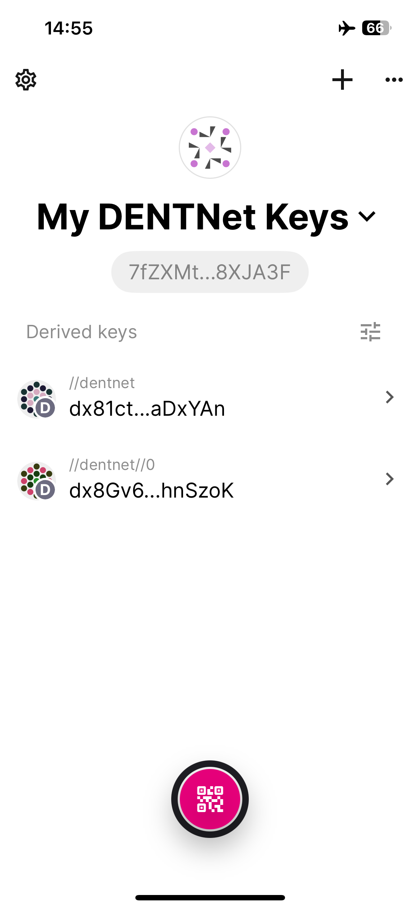

# Vault App

DENTNet is compatible and usable with the **Vault** mobile app. It allows everyone with a smartphone to create a private key, backup, and export this key. Users of the app can create multiple accounts with this key. Three steps are needed to set the app up:

* Install the app
* Add DENTNet network
* Import DENTNet Metadata

Follow the instructions below to set up the Vault app.&#x20;

&#x20;

<figure><figcaption>
Screenshot of Vault app with example accounts
</figcaption></figure>

### Install App&#x20;

You can follow these instructions on how to install and use the Vault App: [Vault App Help.](https://paritytech.github.io/parity-signer/tutorials/Start.html)

### Configure for DENTNet

To use the keys created in the Vault app, you need to add DENTNet as a network and import the metadata.

#### Add DENTNet network

In the Vault App, please open the Settings menu and tap on "Networks". Then tap on "Add new network". The phone's camera opens to scan a QR code.

DENTNet operates a QR code that can be scanned here: [https://main.dentnet.io/vault](https://main.dentnet.io/vault).

#### Import DENTNet Metadata

Open a browser on your computer and visit the metadata information at [https://main.dentnet.io/vault/?tab=1#/dentnet](https://main.dentnet.io/vault/?tab=1#/dentnet). It shows an **animated QR code** containing all the data the Vault app needs to sign DENTNet transactions.

Open the **Vault app** on your mobile device and tap the **scan button at the bottom** of the home screen.&#x20;

<figure><figcaption>
Scan Button
</figcaption></figure>

**Scan** the animated QR code with the Vault app. This process takes some time.&#x20;

Once finished, the Vault app will show information about the metadata added, like "dentnet 9310".&#x20;

Tap on the  "**Approved**" button.


Future updates of DENTNet can require new metadata and therefore an additional scan of the metadata.


The Vault app is now ready to be used with DENTNet.

You can find more information about the app on the official website: [https://signer.parity.io](https://signer.parity.io).

